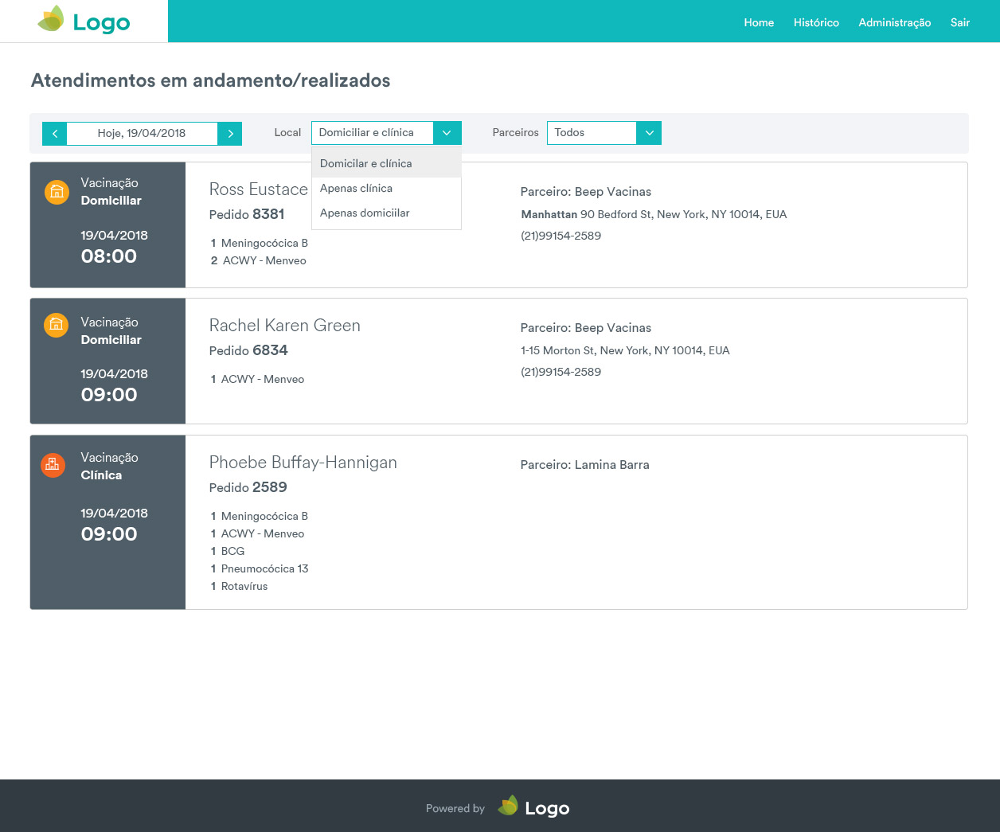

# Beep Saúde - Desafio para Front End

## Visão geral do processo

Olá, obrigado por participar do processo de seleção para Front End. O objetivo deste desafio é apresentar ao candidato uma pequena amostra dos tipos de problemas que lidamos no dia a dia aqui na Beep Saúde.

### O problema

Vacinação domiciliar e em parceiros é um dos serviços que o Beep oferece ao seus clientes. A operação precisa saber como a agenda de vacinação do dia está organizada para realizar a alocação de enfermeiros e para facilitar o atendimento dos clientes. Por exemplo, houve algum problema com um parceiro, vamos precisar reagendar as vacinas de um dia. 

Para resolver este problema, precisamos disponibilizar no nosso sistema interno, uma visão simples de como está a ocupação da agenda de vacinação em uma determinada data. Nosso time de design pensou em uma interface bastante simples onde o usuário de operação pudesse visualizar a agenda e aplicar alguns filtros. 

### Seu objetivo

O candidato deverá implementar a tela de visualização de agendas de maneira mais próxima possível ao layout proposto pelo time de design.



### Arquivos do projeto

Existem 2 pastas importantes: `data` e `images`.

Todos os dados estão disponíveis no arquivo `data.json` dentro da pasta `data`.

Estes dados disponíveis tem o seguinte schema. Segue o exemplo:

```javascript
{
      "id":4,
      "call_id":9046,
      "ticket_voucher":"9046",
      "schedule_date":"2018-05-21T07:30:00.000-03:00",
      "product_type":"vaccines",
      "modality":"homecare",
      "requester":{
        "name":"Rafaela Geisiane",
        "phone":"(21)99878-9098"
     },
     "partner":{
         "id":5,
         "name":"Beep Vacinas",
         "phone":"(21)35773-231",
         "partner_address":"Rua da Glória, 140"
      },
      "products":[
         {
            "quantity":1,
            "product_name":"Hexavalente",
            "product_category_name":"Infantil"
         },
         {
            "quantity":1,
            "product_name":"Herpes Zóster",
            "product_category_name":"Infantil"
         }
      ],
      "created_at":"2018-05-08T18:53:11.822-03:00",
      "updated_at":"2018-05-08T18:53:11.822-03:00"
   },
```

##### Atributos importantes

|Atributo       | Atributo na tela|
|---------------|-----------------|
| ticket_voucher| Pedido          |
| modality      | Local           |
| schedule_date | data do agendamento|
| requester     | dados do solicitante|
| partner       | parceiro         |


Na pasta `images` estão as imagens dos logos que serão usados no layout.
O layout de referência está disponível na imagem: teste-front-end.jpg.


### Funcionamento da tela

Os dados que serão usados na exibição estão disponíveis na pasta data/. Existem 4 exemplos de dados de agendamento. Estes dados que deverão ser exibidos. Os que estão no layout são para referência.

##### Filtros

Existem um conjunto de filtros no topo da página: data de agendamento, local e parceiro. Estes filtros visam facilitar a operação na hora de tentar encontrar agendamentos.

Os filtros devem ser aplicados de maneira cumulativa.

Por exemplo: 

Escolheu uma data, ao aplicar um filtro de local, estes devem respeitar os locais existentes junto com aquela data selecionada. E o mesmo para parceiros.


##### Filtro por data

Ao abrir a página, a data selecionada deve ser a do dia atual (hoje) e mostrar os agendamentos para o dia. 

Ao clicar na data, deve abrir um calendário e permitir o usuário selecionar o dia que ele quer ver.

Ao clicar nas setas `< >` a data deve avançar ou retroceder em um dia, além disso filtrar os agendamentos para aquele dia.

No Json que está na pasta data, o atributo que deve ser usado para o filtro de data é o `schedule_date`.

##### Local

Local é onde a vacina será aplicada. As opções do dropdown podem ser: `Domiciliar e Clínica`, `Apenas clínica`, `Apenas domiciliar`.

Para filtrar estes dados, deve utilizar o atributo  `modality` com as seguintes configurações:

| modality | significado |
|----------|-------------|
| office   | clínica     |
| homecare | domiciliar  |

Ao clicar em cada opção, a lista deverá ser filtrada.

##### Parceiros

Parceiros são aqueles responsáveis por realizar a aplicação de vacinas. As opções do dropdown devem ser: `Lâmina Icaraí`, `Beep Vacinas` e `Lâmina Barra`.

Para filtrar os dados, deve se utilizar o atributo `partner`.


### O que levaremos em consideração

* organização e escrita do código HTML + CSS
* organização do código em javascript
* implementação do layout de acordo com a proposta do time de design

Bônus:
* layout responsivo
* utilização de algum framework javascript
* minificar javascript e css
